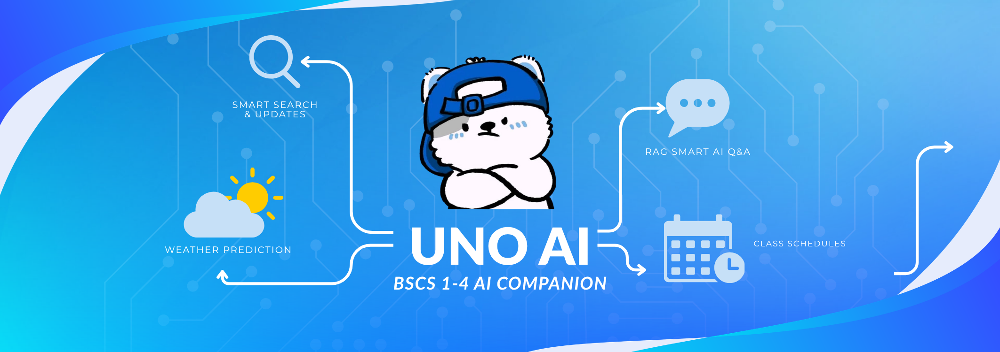

<div align="center">



# 🤖 Uno AI (`uno-discord-bot`)

**A class-aware Discord assistant for BSCS 1-4 — assignments, schedules, OCR, and grounded AI chat.**
*Pamantasan ng Lungsod ng Maynila (PLM)*

[](https://python.org)
[](https://discordpy.readthedocs.io/)
[](https://www.assemblyai.com/docs/llm-gateway/quickstart)
[](https://qdrant.tech)
[](LICENSE)

</div>

---

## 👋 Welcome Freshmen! What is Uno AI?

**Uno AI** is a smart, nonchalant Discord bot designed specifically for our Computer Science college block section (**BSCS 1-4**).

Uno AI reads approved class announcements, scans homework screenshots, keeps track of the section schedule, and answers questions using retrieval-augmented generation. Qdrant stores the controlled class index, Google Gemini creates embeddings, and Gemini 3.5 Flash generates answers through AssemblyAI's LLM Gateway.

---

## ⚡ Quick Command Reference

Uno AI supports both **Slash Commands (`/`)** and **Prefix Commands (`!`)**. Commands work identically in both formats!

### 🤖 AI & Knowledge Retrieval
| Slash Command | Prefix Alias | What It Does |
|---|---|---|
| `/ask question:<text>` | `!ask <question>` | Ask Uno AI anything! Uses class message memory & OCR homework notes when relevant. |
| `/reset-chat` | `!reset-chat` | Clear your private Uno AI chat memory for the current channel. |
| `/search query:<text>` | `!search <query>` | Search Google for programming docs or academic topics (returns clean, preview-free links). |

### 📄 Document Analysis (Slash-Only)
| Slash Command | What It Does |
|---|---|
| `/analyze file:<attachment>` | Upload a PDF or PPTX slide deck to get an instant AI summary. |
| `/docask question:<text>` | Ask follow-up questions grounded strictly in your uploaded document. |

### 📅 Academic Schedule & Professors
| Slash Command | Prefix Alias | What It Does |
|---|---|---|
| `/today` | `!today` | Show today's class schedule, room assignments, and times. |
| `/schedule` | `!schedule` | Display the full weekly section schedule. |
| `/nextclass` | `!nextclass` | View the next upcoming class for today. |
| `/prof subject:<name>` | `!prof <subject>` | Look up instructor name, email, and subject details. |

### ⛅ Weather & Disruption Risk
| Slash Command | Prefix Alias | What It Does |
|---|---|---|
| `/weather` | `!weather` | Real-time weather, 6-hour forecast, official PAGASA NCR warnings, and class disruption risk (*LOW*, *MODERATE*, *HIGH*). |

### ⚙️ General & Info
| Slash Command | Prefix Alias | What It Does |
|---|---|---|
| `/about` | `!about` | Learn how Uno AI retrieves context and generates answers. |
| `/help` | `!help` | Open the interactive command guide. |
| `/ping` | `!ping` | Check bot connection latency. |
| `/userinfo` | `!userinfo` | View public account details. |
| `/serverinfo` | `!serverinfo` | View server metadata. |

---

## 💡 Casual Chat & Mention Feature

You don't always need to run a command!
- **`@Uno AI` in chat**: Tag Uno AI anywhere in a channel and it will reply contextually.
- **Reply to Uno AI**: Reply naturally; Uno keeps a small per-user history and only reads up to three nearby messages for an ambiguous reply.

Chat memory is isolated by server, channel, and user. It keeps at most four completed turns, expires after 30 minutes, and can be cleared with `/reset-chat`.

---

## 🧩 How Uno AI Works (Under the Hood)

Here is how the system works in simple terms:

```text
                                  +---------------------------------------+
                                  |            Discord Client             |
                                  +-------------------+-------------------+
                                                      |
                                                      v
                                        +---------------------------+
                                        |  UnoDiscordBot (client.py)|
                                        +-------------+-------------+
                                                      |
         +-------------------+------------------------+-----------------------+-------------------+
         |                   |                        |                       |                   |
         v                   v                        v                       v                   v
  +--------------+   +---------------+        +---------------+       +---------------+   +---------------+
  |   AICog      |   | KnowledgeCog  |        |  MentionsCog  |       |  AcademicsCog |   |  WeatherCog   |
  | (/ask, !ask) |   |  (Ingestion)  |        | (@Uno AI &    |       | (/today,      |   |  (/weather,   |
  +------+-------+   +-------+-------+        |   replies)    |       |  /schedule)   |   |   !weather)   |
         |                   |                +-------+-------+       +-------+-------+   +-------+-------+
         |                   |                        |                       |                   |
         v                   v                        v                       v                   v
  +--------------+   +---------------+        +---------------+       +---------------+   +---------------+
  | Shared Chat  |   |  OCRService   |        | Shared Chat   |       | Local JSON    |   | Open-Meteo +  |
  | Orchestrator |   | (RapidOCR +   |        | Orchestrator  |       | Schedule Data |   | PAGASA Parser |
  | + Safe Tools |   |  ONNX Local)  |        +-------+-------+       +---------------+   +---------------+
  +------+-------+   +-------+-------+                |
         |                   |                        |
         +-------------------+------------------------+
                             |
                             v
               +---------------------------+
               | Qdrant + Gemini Embedding |
               | 2 + Gemini 3.5 Flash      |
               +---------------------------+
```

1. 🧠 **Gemini 3.5 Flash through AssemblyAI**: Generates concise answers from the user's question and any relevant class context.
2. 📦 **Qdrant + Gemini Embedding 2**: Stores 768-dimensional vectors and source metadata so Uno can retrieve semantically related class messages.
   Assignment retrieval favors newer structured homework and announcement posts over casual messages. Schedule, subject, and professor lookups use local trusted data and still work if Qdrant or embeddings are unavailable.
3. 👁️ **RapidOCR (Local OCR)**: Scans homework images (`.png`, `.jpg`) posted in approved homework channels and extracts the text so `/ask` can recall assignments from screenshots.
4. ⛅ **Open-Meteo & PAGASA Scraper**: Pulls live Manila weather data and scrapes official PAGASA NCR-PRSD rainfall/thunderstorm warnings to compute class disruption risk.

---

## 🔒 Security & Privacy Guarantees

- **Controlled Cloud Processing**: Approved messages are sent to Google to create embeddings. A user's question and relevant retrieved context are sent through AssemblyAI's LLM Gateway to Gemini for answer generation.
- **Private Vector Store**: The Qdrant service is not exposed publicly and remains under the deployment owner's control.
- **Guild Isolation**: Knowledge indexed in one Discord server can **never** be accessed or retrieved in another server.
- **Allowlisted Channels**: Uno AI only indexes messages from channels explicitly specified in `INDEXED_CHANNEL_IDS`.
- **Command Disconnection**: Commands (like `!ask` or `/search`) are excluded from Qdrant indexing so bot prompts are never re-indexed as knowledge.

---

## 💻 Developer Setup Guide (How to Run Locally)

Want to run Uno AI on your own computer or contribute code? Follow these steps:

### 1. Prerequisites
- **Python 3.12+** installed
- **Docker Desktop** installed (for Qdrant)
- **AssemblyAI API key** for Gemini 3.5 Flash generation
- **Google Gemini API key** for Gemini Embedding 2

### 2. Start Qdrant Vector Database

```bash
docker volume create uno_qdrant_storage

docker run -d --name uno-qdrant \
  -p 6333:6333 \
  -v uno_qdrant_storage:/qdrant/storage \
  qdrant/qdrant
```

### 3. Clone & Setup Project Environment

```bash
git clone https://github.com/cadornajansen/uno-discord-bot.git
cd uno-discord-bot

# Create and activate virtual environment
python -m venv .venv
.venv\Scripts\activate       # On Windows
# source .venv/bin/activate  # On Linux/macOS

# Install dependencies
pip install -e ".[dev]"
```

### 4. Configure `.env` File

Copy `.env.example` to `.env`:

```bash
cp .env.example .env
```

Fill in your `.env` configuration:

```env
DISCORD_TOKEN=your_bot_token_here
DEV_GUILD_ID=your_test_server_id_here

ASSEMBLYAI_API_KEY=your_assemblyai_api_key_here
ASSEMBLYAI_LLM_MODEL=gemini-3.5-flash
ASSEMBLYAI_LLM_MAX_TOKENS=1000

GEMINI_API_KEY=your_gemini_api_key_here
GEMINI_EMBEDDING_MODEL=gemini-embedding-2
GEMINI_EMBEDDING_DIMENSIONS=768

QDRANT_URL=http://localhost:6333
QDRANT_COLLECTION=discord_messages_gemini_v1
INDEXED_CHANNEL_IDS=123456789012345678
OCR_CHANNEL_IDS=123456789012345678

RAG_TOP_K=5
RAG_MIN_SCORE=0.50
RAG_MAX_CONTEXT_RESULTS=3

SERPER_API_KEY=your_serper_key_here
```

### 5. Run Automated Tests

```bash
python -m pytest
```

### 6. Launch the Bot

```powershell
# Standard run:
python main.py

# Or use the production auto-restart launcher:
.\start.ps1
```

### Azure Deployment

The low-usage deployment needs only Uno and Qdrant on one CPU VM; Gemini APIs
handle embeddings and generation. Follow the tested setup and safety checklist
in [`deploy/azure/README.md`](deploy/azure/README.md).

---

## 📜 License

Distributed under the [MIT License](LICENSE).
